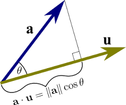

# *Vector Dot-Product Implementation*

Welcome to the implementation of the *vector dot-product algorithm*. This repository includes:

- The *mathematical expression* of the dot product.
- A *code snippet* showcasing the implementation.
- A *diagram* to visualize the operation.
- A *table* comparing various versions of the algorithm.
- All Markdown elements utilized as part of this documentation.

---

## *What is a Dot Product?*

The dot product is a mathematical operation that takes two equal-length sequences of numbers (vectors) and returns a single number. It is defined mathematically as:

$$
\mathbf{a} \cdot \mathbf{b} = \sum_{i=1}^n a_i b_i
$$

## *Code Implementation*

Below is a Python implementation of the vector dot-product algorithm:

python
def dot_product(vector_a, vector_b):
    if len(vector_a) != len(vector_b):
        raise ValueError("Vectors must be of the same length")
    return sum(a * b for a, b in zip(vector_a, vector_b))

# Example usage:
vector_a = [1, 2, 3]
vector_b = [4, 5, 6]
result = dot_product(vector_a, vector_b)
print("Dot Product:", result)

> This is a quote. A quote is generated using ">" followed by the quote.

- [This is the link to my github repository](https://github.com/FumioMax/Assignment04)

---

---

Markdown supports footnotes.[^1] They are useful for adding explanations or references.[^2]

[^1]: First footnote.
[^2]: Second footnote. 

| Column1 | Column2 | Column3 |
|---------|---------|---------|
| one | two | three |
| four | five | six |
| seven | eigen | nine |

- [x] Completed Task
- [ ] Incomplete Task

> [!NOTE]
> This is an alert.